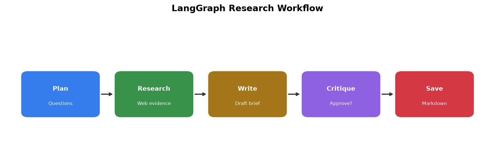
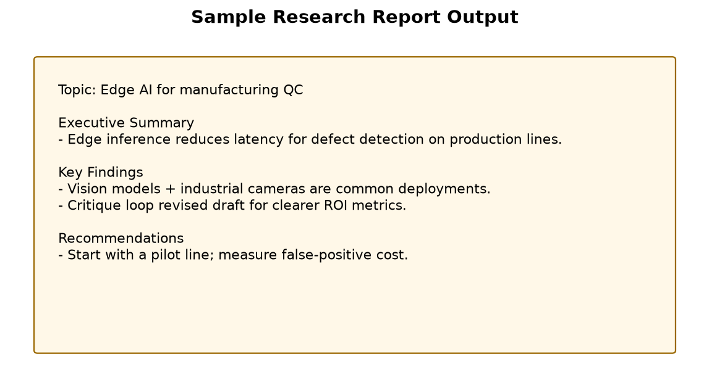

# LangGraph Research Workflow

A multi-step **LangGraph** agentic research pipeline:

```
START → plan → research → write → critique ⇄ write → save → END
```

## What each node does
| Node | Role |
|------|------|
| `plan` | Structured research questions |
| `research` | DuckDuckGo evidence gathering |
| `write` | Draft research brief with LLM |
| `critique` | Approve or request revision |
| `save` | Persist markdown report |

## Setup
```bash
cd langgraph-research-workflow
python -m venv .venv
.venv\Scripts\activate
pip install -r requirements.txt
copy .env.example .env
```

## Run
```bash
python workflow.py
streamlit run app.py
```

## Why LangGraph?
LangGraph makes loops, branching, and revision cycles first-class — ideal for agent workflows that need quality gates.

## Sample Outputs


